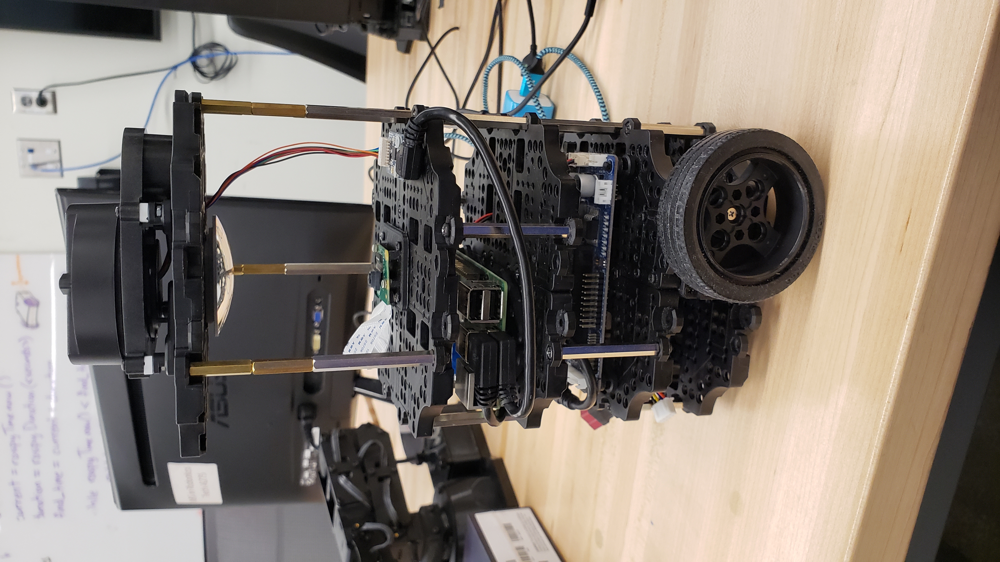
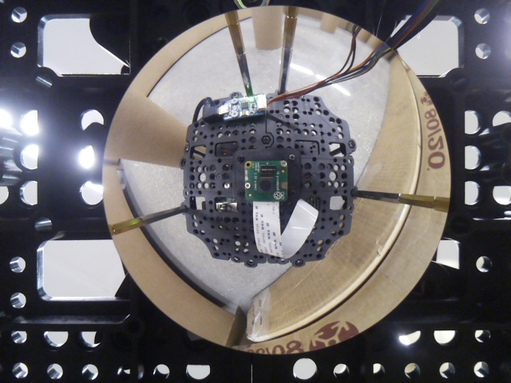
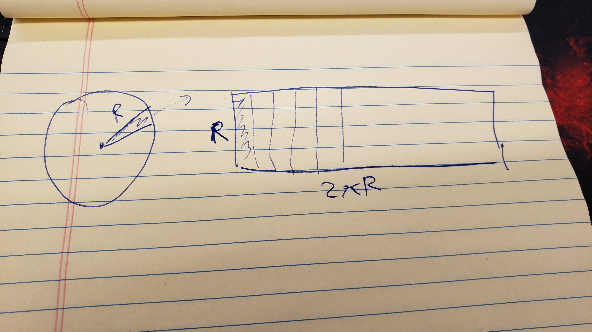
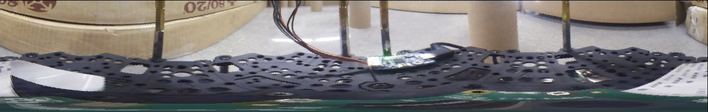

# MSRFinalProject
Final Project for MSR

Implementation of this paper: https://ieeexplore.ieee.org/document/4543324

Goal of this paper is to be able to tell the distance of level objects from robot by only using cameras

This method involves implementing the Gaussian Process Algorithm

<h1> Steps Taken to do the project</h1>

<h2>Hardware Setup</h2>

Turtlebot3  
[additional waffle plate](https://www.robotis.us/tb3-waffle-plate-ipl-01-8ea/)  
[M2 screws](https://www.amazon.com/HanTof-Washers-Assortment-Machine-Stainless/dp/B082XRX17Z/ref=asc_df_B082XRX17Z/?tag=hyprod-20&linkCode=df0&hvadid=416774286618&hvpos=&hvnetw=g&hvrand=16898008894177674308&hvpone=&hvptwo=&hvqmt=&hvdev=c&hvdvcmdl=&hvlocint=&hvlocphy=9021564&hvtargid=pla-901437054371&psc=1&tag=&ref=&adgrpid=95471660538&hvpone=&hvptwo=&hvadid=416774286618&hvpos=&hvnetw=g&hvrand=16898008894177674308&hvqmt=&hvdev=c&hvdvcmdl=&hvlocint=&hvlocphy=9021564&hvtargid=pla-901437054371)  
[convex mirror](https://www.edmundoptics.com/p/50mm-dia-x25mm-fl-enhanced-aluminum-convex-mirror-/29998/)  
[M3 Standoffs](https://www.amazon.com/Csdtylh-Male-Female-Standoff-Stainless-Assortment/dp/B06Y5TJXY1/ref=sr_1_4?crid=1EYKXSMDMV6A7&dchild=1&keywords=m3+standoff+assortment&qid=1634152182&sprefix=m3+standoff+assortment%2Caps%2C443&sr=8-4)  
Raspberry Pi camera  
[3D printed camera mount](raspberreypi_cameraholder.stl)

<h3>Building the robot</h3> 
To build the robot, disassembled the top layer, including the LIDAR, place the Raspberry Pi camera on the second top layer such that it is centered on the robot.  Camera mount was 3D printed.  Move the USB2LDS board to the same layer as camera.  Assemble the waffle plate and attach the convex mirror to the bottom of it.  Plug Raspberry pi camera into the raspberry pi board 

<h3>Testing the camera</h3>
Turn on the raspberry pi camera by ssh into the robot.  After I sshed into the robot and ran:  

 `rosrun usb_cam usb_cam_node _pixel_format:=yuyv` 

In another tab I ran `rqt_image_view` to check if the camera was working.  The camera should publish to `/usb_cam/image_view` topic.  

<h3>Finish Assembly</h3>  
After checking that the camera works.  Add spacers and calibrate the camera such that the camera can clearly film the mirror's reflection of the robot's surrounding clearly  Reassemble the LIDAR system back to the robot.  The data generated from the LIDAR system will be used as the ground truth camera

<h2>Training the machine learning model<h2> 

<h3>Capure a dataset of images and LIDAR scans</h3>  

After system is set up, record a bag file of the camera 

`rosbag record -O <name of rosbag file> /usb_cam/image_view /scan`

After recording the bag file, I wrote [a launch file](laser_values/src/multipleImages/export.launch) that would export the images from the bag file and save it to a hidden folder named .ros in the home directory.  To run this, you can do `roslaunch laser_values export.launch`  You can copy the files from the folder to whatever folder you would like by running `mv ~/.ros/frame*.jpg <dest folder>`
Example of image generated:  
  

<h3>Generating the LIDAR data</h3>

In addition to capturing the images, I wrote [a launch file](laser_values/launch/laserScan.launch).  This allows the LIDAR data to be saved into a csv file, which would eventually be used to train the Gaussian Process Model.  To run the file, you can do `roslaunch laser_values laserScan.launch`

<h3>Unwarping the Images</h3>  

  

As sbown in the image, to unwarp the image, I used the OpenCV library to detect the circle of the image.  I then isolated that region and used OpenCV to determine the radius and the center of the circle.  From there, I created a R by 2 $\pi $ R, where R being the radius of the circle.  I then mapped each coordinate to each pixel value of the circle, resulting in the image shown.  

  
The code can be run as a standalne script in this [file](laser_values/src/unwrappingimage.py)

<h3>Applying PCA on the image</h3>  

To apply the PCA on the HSV image, I first split the images into its three seperate components.  I then normalized them by dividing the Hue channel by 180, the saturation channel by 255, and the value channel by 255 since H had a range of (0, 180), S had a range of (0, 255), and V had a range of (0, 255).  I then append the results into a numpy array.  Each image initially had a size of (140,360), when flattened out became a size of 420 x 360.  To reduce the dimension of the image, I first looped through each column of the image and then created the covariance matrix corresponding to the column.  Then, I computed the eigenvalues and their corresponding eigenvectors.  Next, I sorted the eigenvectors based off the numeric value of their corresponding eigenvalue, and stored the first 6 eigenvectors corresponding to the first six largest eigenvalues.  Call this the feature vector  Then I transformed the flattened image by multiplying the transpose of the feature vector with the transpose of flatten image to get a transformed series of columns with reduced dimensions.  In the experiment, I transformed 600 420x360 images from to a new matrix of 6 x 216000, which would be inputted to the Gaussian Process

<h3>Training the Gaussian Process Model</h3>  

Once the image columns have been reduced, I input them with the corresponding distance values calculated from the LIDAR into the Gaussian Process Library from scikit learn.  This generates a model which I save into a .sav file using the joblib library.  To generate the model, you can run  

`python3 PCAsaveGPAModel.py`

in the terminal.

<h2> Testing the Gaussian Model with the raspberrypi camera</h2>  

<h3>Running the algorithm with the robot</h3> 

To run the Gaussian Process Model with the robot.  I first started roscore on the local computer, Then in a new tab sshed into the robot using

`ssh -o SendEnv=ROS_MASTER_URI msr@gauss` 

This will prompt for a password.  If you failed to connect to the robot due to issues related to permission, you can run  
`ssh-add ~/.ssh/id_turtle`

Once in the turtlebot, set the permission of the camera by doing 
`sudo chmod 777 /dev/video0` 

Once the permissions was set, open a new tab to run the turtlebot with the camera.  There are two ways to run the robot.  Both allow you to run SLAM while controlling the robot using WASD keys
The first way is to run the robot with LIDAR:  

`roslaunch laser_values cameraLaunch.launch runLidar:=true runGaussProc:=false`

The second way is to run the robot using the depth values generated from the Gaussian Process Model and camera without the LIDAR running:  

`roslaunch laser_values cameraLaunch.launch runLidar:=false runGaussProc:=true`  

If no arguments are given, it will default to the first way.  Once the launch file is running, you can move the robot around to generate the map.  Once you are satisfied with the map, you can save the result using 

`rosrun map_server map_saver -f <filename for .pgm>`

in another terminal

