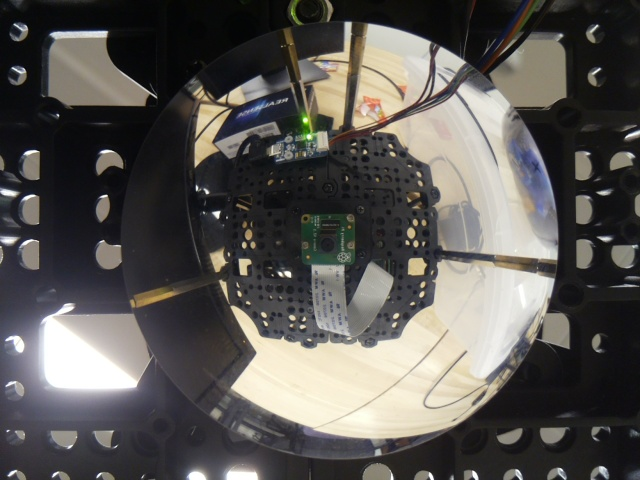

# MSRFinalProject
Final Project for MSR

Implementation of this paper: https://ieeexplore.ieee.org/document/4543324

Goal of this paper is to be able to tell the distance of level objects from robot by only using cameras

This method involves implementing the Gaussian Process Algorithm


<h1> Steps Taken to do the project</h1>

<h3>Hardware Setup</h3>

Turtlebot3  
[additional waffle plate](https://www.robotis.us/tb3-waffle-plate-ipl-01-8ea/)  
[M2 screws](https://www.amazon.com/HanTof-Washers-Assortment-Machine-Stainless/dp/B082XRX17Z/ref=asc_df_B082XRX17Z/?tag=hyprod-20&linkCode=df0&hvadid=416774286618&hvpos=&hvnetw=g&hvrand=16898008894177674308&hvpone=&hvptwo=&hvqmt=&hvdev=c&hvdvcmdl=&hvlocint=&hvlocphy=9021564&hvtargid=pla-901437054371&psc=1&tag=&ref=&adgrpid=95471660538&hvpone=&hvptwo=&hvadid=416774286618&hvpos=&hvnetw=g&hvrand=16898008894177674308&hvqmt=&hvdev=c&hvdvcmdl=&hvlocint=&hvlocphy=9021564&hvtargid=pla-901437054371)  
[convex mirror](https://www.edmundoptics.com/p/50mm-dia-x25mm-fl-enhanced-aluminum-convex-mirror-/29998/)
[M3 Standoffs](https://www.amazon.com/Csdtylh-Male-Female-Standoff-Stainless-Assortment/dp/B06Y5TJXY1/ref=sr_1_4?crid=1EYKXSMDMV6A7&dchild=1&keywords=m3+standoff+assortment&qid=1634152182&sprefix=m3+standoff+assortment%2Caps%2C443&sr=8-4)  
Raspberry Pi camera  
[3D printed camera mount](raspberreypi_cameraholder.stl)

<h3>Building the robot</h3>
To build the robot, disassembled the top layer, including the LIDAR, place the Raspberry Pi camera on the second top layer such that it is centered on the robot.  Camera mount was 3D printed.  Move the USB2LDS board to the same layer as camera.  Assemble the waffle plate and attach the convex mirror to the bottom of it.  Plug Raspberry pi camera into the raspberry pi board 

<h3>Testing the camera</h3>
Turn on the raspberry pi camera by ssh into the robot.  After I sshed into the robot:
```
rosrun usb_cam usb_cam_node _pixel_format:=yuyv
```
In another tab I ran `rqt_image_view` to check if the camera was working.  The camera should publish to `/usb_cam/image_view` topic.  

<h3>Finish Assembly</h3>
After checking that the camera works.  Add spacers and calibrate the camera such that the camera can clearly film the mirror's reflection of the robot's surrounding clearly  Reassemble the LIDAR system back to the robot.  The data generated from the LIDAR system will be used as the ground truth camera

<h3>Capure a dataset of images</h3>
After system is set up, record a bag file of the camera 

`rosbag record -O subset /usb_cam/image_view`

After recording the bag file, I wrote [a launch file](laser_values/src/multipleImages/export.launch) that would export the images from the bag file and save it to a hidden folder named .ros in the home directory.  You can copy the files from the folder to whatever folder you would like by running `mv ~/.ros/frame*.jpg <dest folder>`
Example of image generated:  
  


<h3>Unwarping the Images</h3>
  

As sbown in the image, to unwarp the image, I used the OpenCV library to detect the circle of the image.  I then isolated that region and used OpenCV to determine the radius and the center of the circle.  From there, I created a R by 2$\pi$R, where R being the radius of the circle.  I then mapped each coordinate to each pixel value of the circle, resulting in the image shown  


  

<h3>Applying PCA on the image</h3>  

To apply the PCA on the HSV image, I first split the images into its three seperate components.  I then normalized them by dividing the Hue channel by 180, the saturation channel by 255, and the value channel by 255 since H had a range of (0, 180), S had a range of (0, 255), and V had a range of (0, 255).  I then stored them as Series and appended to their respected pandas Dataframes.  I then called create a 6 component PCA using scikitlearn's PCA function, and fitted it to the respective PCAs.  I then called the transform function to get the resulting PCA matrix

<h3>Applying Gaussian Process on the image</h3> 


